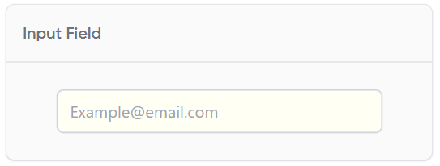
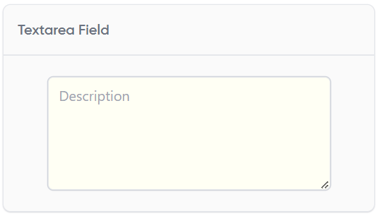
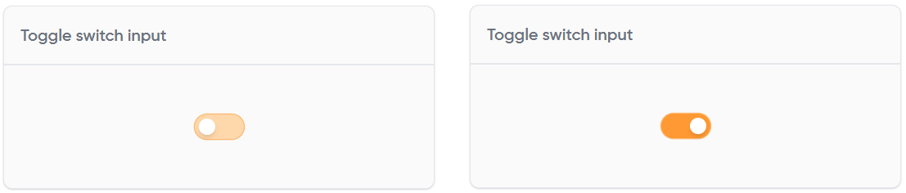
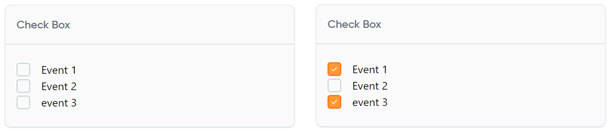
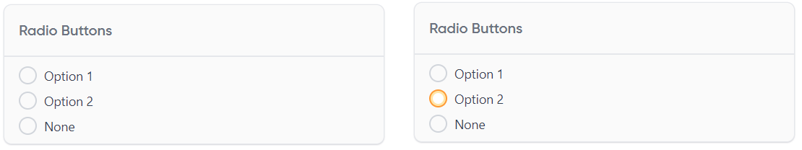
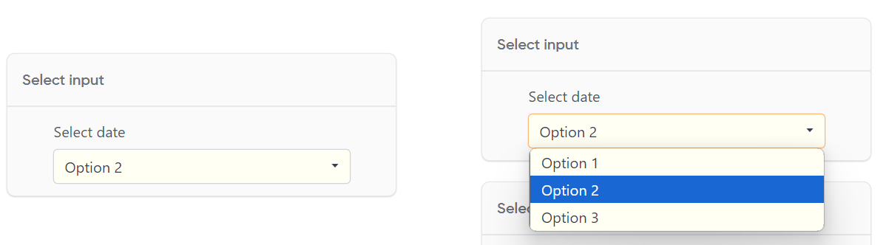
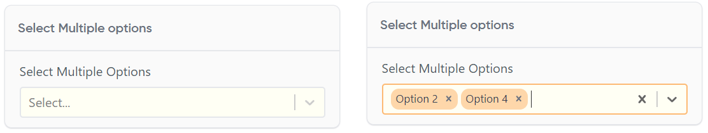
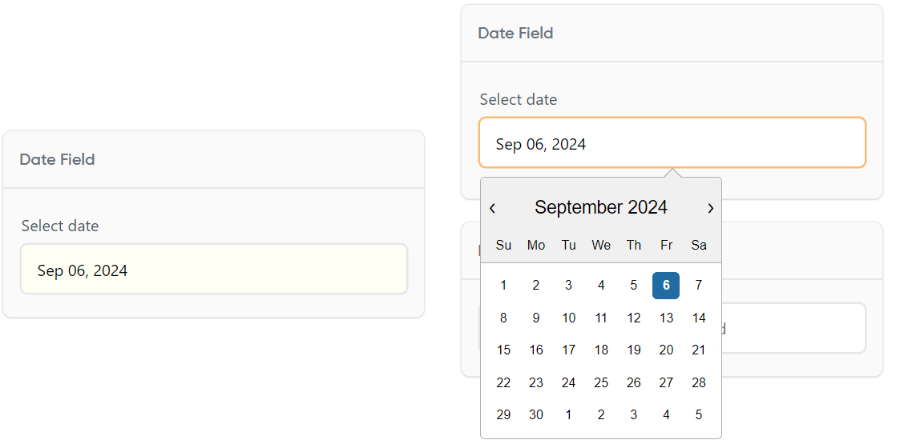
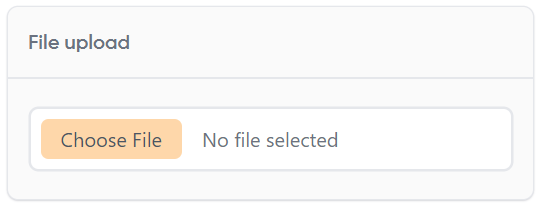
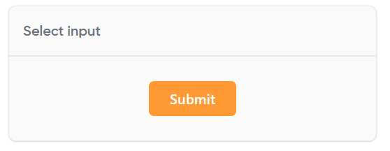

# React UI Component Library for MM

A sleek and customized React UI component library for Reusability, specially to make forms!

Play around, visit. <a href="https://react-ui-component-library-six.vercel.app/" target="_blank">Ui Components</a>

## Components

Our library includes the following components:

1. Input Field
2. Textarea Field
3. Toggle Switch
4. Checkbox
5. Radio Buttons
6. Select Input
7. Select Multipule
8. Date Field
9. File Upload
10. Submit Button

## Component Details

### 1. Input Field

- Versatile text input for collecting various types of user data (e.g., email, username, password)
- Supports placeholder text, validation states, and custom styling

### 2. Textarea Field

- Multi-line text input ideal for longer form responses or descriptions
- Resizable with customizable minimum and maximum heights

### 3. Toggle Switch

- Intuitive on/off switch for boolean inputs
- Animated transition between states with customizable colors

### 4. Checkbox

- Allows selection of multiple options from a list
- Supports indeterminate state for parent-child relationship in nested lists

### 5. Radio Buttons

- Enables selection of a single option from a group
- Customizable button styles and layouts (e.g., horizontal, vertical)

### 6. Select Input

- Dropdown menu for selecting option from a list
- Dosen't Supports search functionality for large option sets

### 7. Select Multipule

- Dropdown menu for selecting one or multiple options from a list
- Dosen't Supports search functionality for large option sets
- 
### 8. Date Field

- User-friendly date picker with calendar interface
- Configurable date formats and range restrictions

### 9. File Upload

- Drag-and-drop interface for easy file uploading
- Progress indicator and support for multiple file selection

### 10. Submit Button

- Customizable button for form submission or primary actions
- Supports loading states and icon integration

## many more to come!!!
